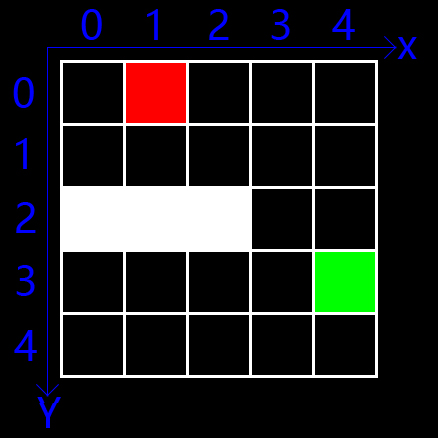
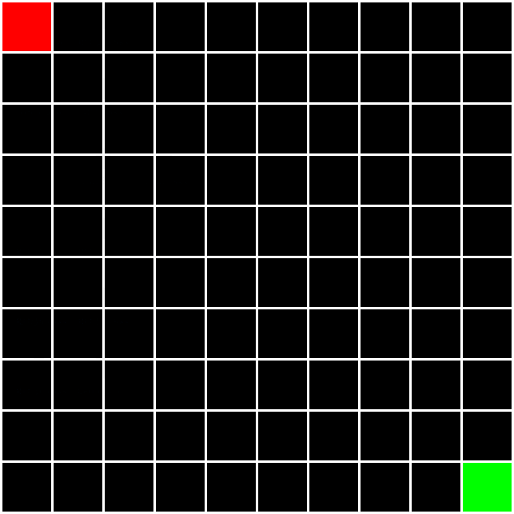
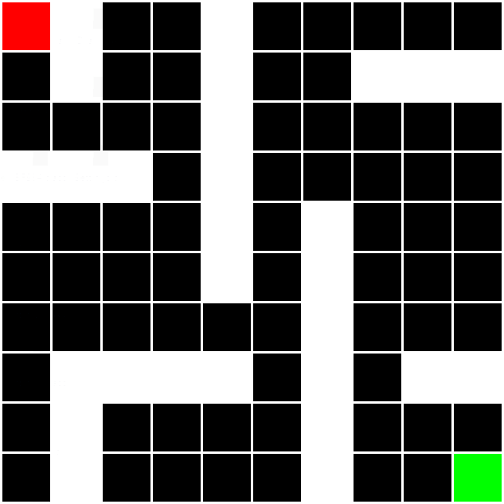
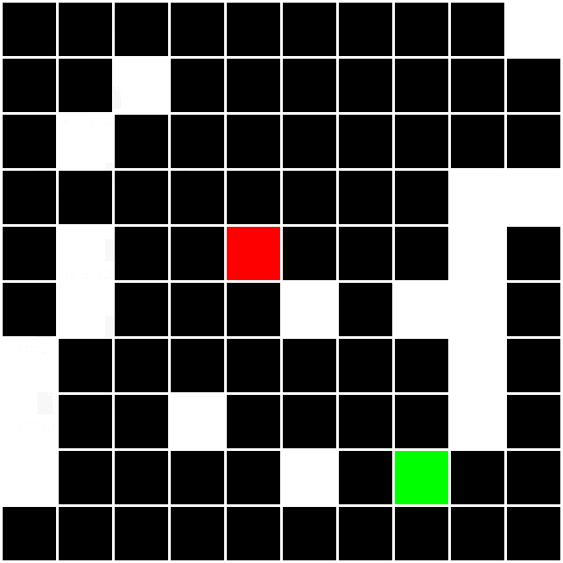

动画演示广度优先搜索（BFS）寻找迷宫最短路径
## 运行
已去掉包名，进入文件夹编译运行即可
```
javac Main.java & java Main
```
## 自定义地图
如图，黑色表示路，白色表示墙壁，红色表示起点，绿色表示终点<br>
<br><br>
在Settings的setMap()中可设置
```java
class Settings {
    static final byte[][] MAP = setMap();

    private static byte[][] setMap() {
        byte[][] map = new byte[5][5];
        map[1][0] = 2;
        map[4][3] = 3;
        for (int i = 0; i < 3; i++) {
            map[i][2] = 1;
        }
        return map;
    }
}
```
地图是用byte类型的二维数组储存的，默认初始化为0表示路，1表示墙壁，2表示起点，3表示终点
## 动画演示
* 10 * 10的地图，起点(0, 0)，终点(9, 9)，没有墙壁
```
byte[][] map = new byte[10][10];
map[0][0] = 2;
map[9][9] = 3;
```

* 10 * 10的地图，起点(0, 0)，终点(9, 9)，简单画了些墙壁，已在Setting.java中注释
```
byte[][] map = new byte[10][10];
map[0][0] = 2;
map[9][9] = 3;
for (int i = 0; i < 3; i++) {
    map[i][3] = 1;
    map[4][i] = 1;
    map[4][3 + i] = 1;
    map[6][9 - i] = 1;
    map[6][6 - i] = 1;
    map[1][9 - i] = 1;
    map[2 + i][7] = 1;
    map[9 - i][1] = 1;
    if (i < 2) {
        map[1][i] = 1;
        map[9 - i][7] = 1;
    }
}
```

* 10 * 10的地图，起点(4, 4)，终点(7, 8)，随机生成至多20块的墙壁。<br>
墙壁可能封闭导致无路可走，多试几次吧<br>
```
byte[][] map = new byte[10][10];
map[4][4] = 2;
map[7][8] = 3;
Random r = new Random();
for (int i = 0; i < 20; i++) {
    int x = r.nextInt(10);
    int y = r.nextInt(10);
    while (map[x][y] == 2 || map[x][y] == 3) {
        x = r.nextInt(10);
        y = r.nextInt(10);
    }
    map[x][y] = 1;
}
```
